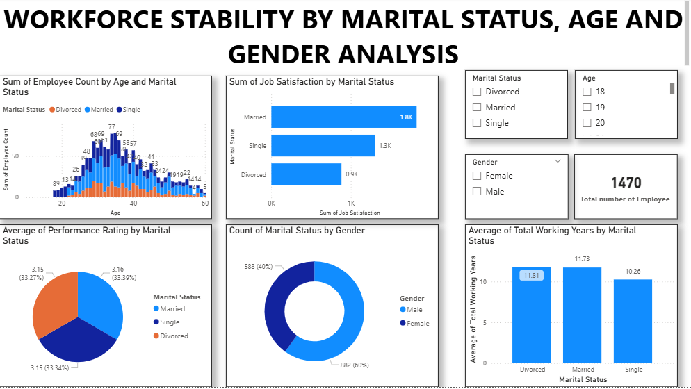
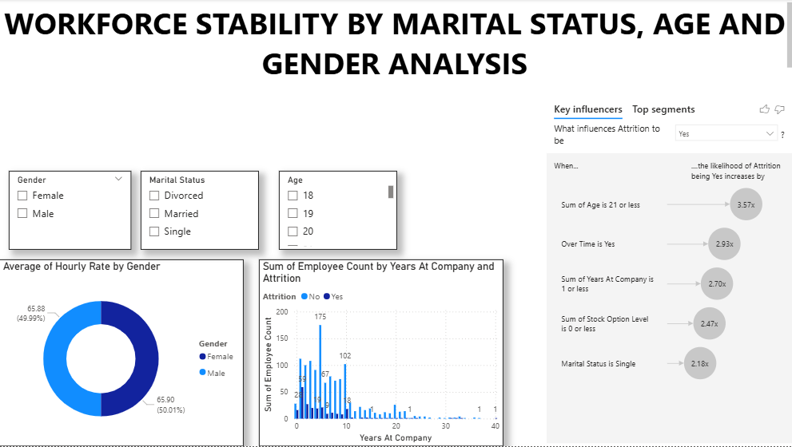

# Workforce-Stability-Analysis
An interactive Power BI dashboard analyzing workforce stability by exploring trends and patterns related to employee marital status, gender and age.
Workforce Stability Dashboard
Analyzing employee turnover and stability based on marital status, gender, and age.

## Overview
This project features a comprehensive and interactive Power BI dashboard designed to analyze and visualize workforce stability within an organization. The primary objective is to identify key trends and patterns in employee retention and turnover by segmenting the data by marital status, gender, and age. This analysis provides actionable insights for Human Resources and management to develop targeted strategies for improving employee satisfaction and reducing voluntary turnover.

## Data Source
The dataset for this dashboard was obtained from Kaggle.com https://www.kaggle.com/datasets/pavansubhasht/ibm-hr-analytics-attrition-dataset. The data was processed and cleaned using Microsoft Excel, Power Query, which involved several key steps:

Initial data profiling and cleansing to handle missing values and inconsistencies.

Transformation of data types to ensure proper formatting for analysis.

Creation of custom columns to categorize employees into distinct age groups for more granular analysis.

## Key Insights
The dashboard provides a visual representation of several key insights, including:

Age and Turnover: Turnover rates are highest among employees in the 20-29 age bracket, indicating a potential need for stronger retention programs for early-career hires.

Gender Differences: The data suggests slight variations in retention rates between male and female employees, particularly within certain departments and age ranges.

Marital Status Impact: The analysis reveals that single employees have a higher turnover rate, .

## Dashboard Visuals
A screenshot of the main dashboard page is included below to provide a quick visual summary of the reports and charts.

Technologies Used
Power BI Desktop: The primary tool used for data modeling, DAX measure creation, and report visualization.

Power Query: Utilized for all data extraction, transformation, and loading (ETL) processes.

DAX (Data Analysis Expressions): Custom measures were written to calculate key metrics such as turnover rate, retention rate, and time to termination.

How to Use
To interact with this dashboard, you will need Power BI Desktop installed on your computer.

Clone the Repository: Download this repository to your local machine.

Open the File: Open the workforce stabilty by marital status age and gender dashboard.pbix file using Power BI Desktop.

The dashboard is fully interactive, allowing you to use slicers and filters to explore the data by marital status, Gender, or Age.
